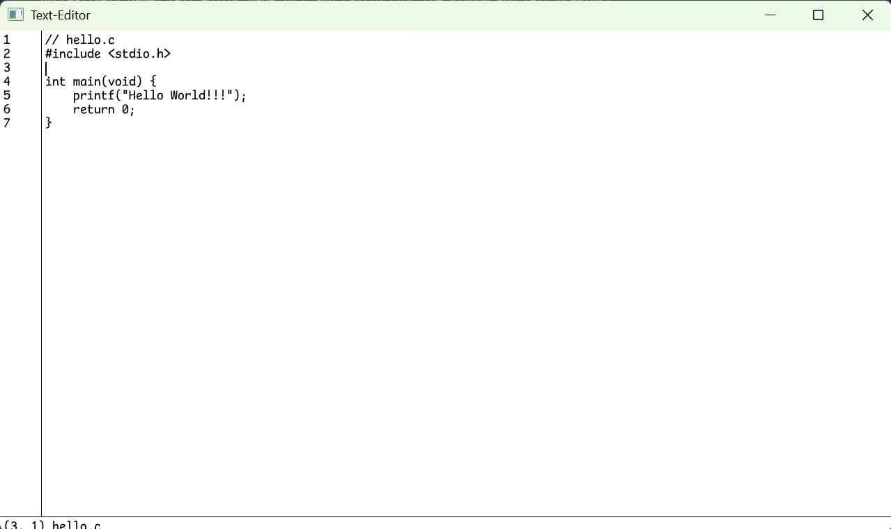
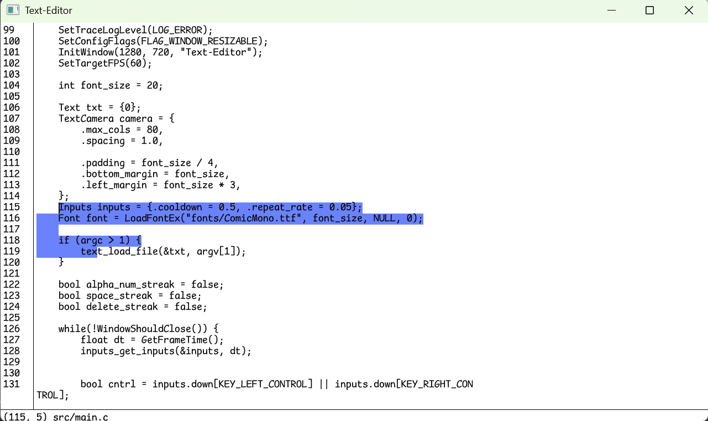

# Text Editor
uncreatively named text editor made in c and raylib (for the window and text drawing)

# Features
- clip board support ctrl + x for cut ctrl + c for copy ctrl + v for paste
- saving and loading currently doesn't have any fancy ui and is done through the terminal
- ctrl + s to save ctrl + l to load
- move around with arrow keys ctrl + left or ctrl + right to skip over words page up and page down to skip many lines at a time
- select by click and dragging or holding shift with the arrow keys
- ctrl + z and ctrl + y to undo and redo

# To Compile
there is an .exe that is compiled for windows it won't work unless you have a directory called fonts with ComicMono.ttf in it (currently the font is hard coded) and the directory must be in the same directory as the executable

if you want to compile the program you simple run 
make all

this will only work on windows as the makefile is only set up to link with windows compiling to other platforms is not currently supported
